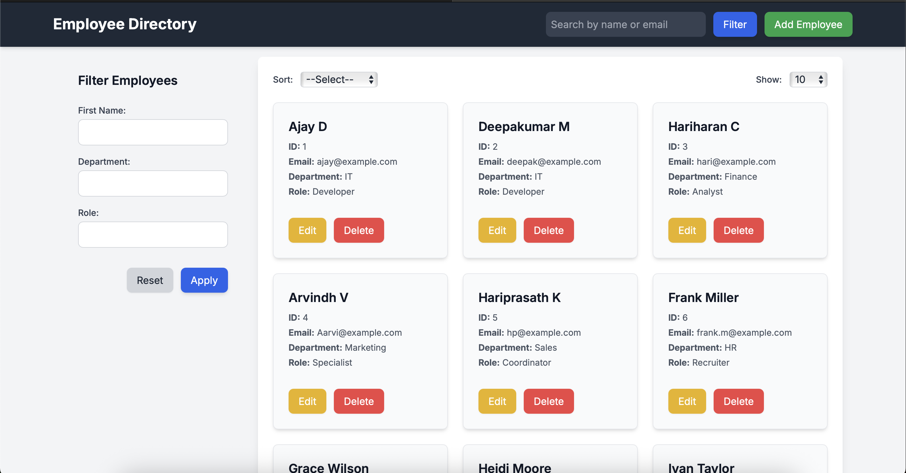

# Employee Directory

A responsive and interactive web application to manage employee records. This project allows users to add, edit, delete, search, filter, sort, and paginate through employee data. It's built entirely using HTML, CSS, and JavaScript — no backend required.

---

## 🚀 Features

- 🔍 **Search Employees** by name or email
- 🧩 **Filter** by department, role, or first name
- ⬆️ **Sort** employees by first name or department
- ➕ **Add/Edit/Delete** employee records using forms
- 📄 **Pagination** support to navigate large datasets
- 📱 **Responsive** design for desktop, tablet, and mobile

---

## 📸 Screenshot



---

## 🗂️ Folder Structure

```text
employee-directory/     
│                
├── index.html           # Main HTML page       
└── style.css            # All styling (layout, colors, fonts)
├── script.js            # All logic (add, edit, delete, filter, etc.)
├── screenshot.png       # Project screenshot
└── README.md            # Project documentation
